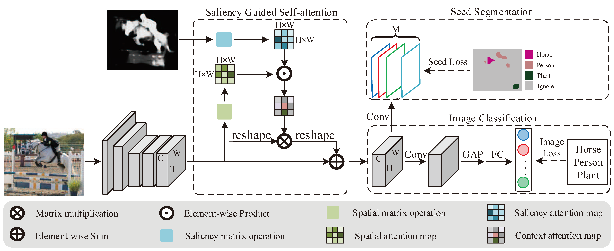

# Saliency Guided Self-attention Network for Weakly and Semi-supervised Semantic Segmentation (IEEE ACCESS)
This code is a implementation of the high-quality seed generation step in the paper [SGAN](https://arxiv.org/abs/1910.05475). The code is developed based on the Pytorch framework.

## Introduction

The proposed approach consists of three components: (1) a CNN backbone to learn deep feature representations; (2) a saliency guided self-attention module that propagates attentions from small discriminative parts to non-discriminative regions; (3) an image classification branch and a seed segmentation branch to supervise the training of the entire network.

### License
SGAN is released under the MIT license

### Citing SGAN
if you find SGAN useful in your research, please consider citing:

## Installation
### 1. Prerequisites
Tested on Ubuntu16.04, CUDA9.0, python3.5, Pytorch 0.4.1, NVIDIA RTX 2080TI

### 2. Dataset
1. Download the prepared [VOC2012 dataset](https://drive.google.com/open?id=1PDTEuTnWJZNWogxYdqYGOlEZHK8dYET9), it contains all the files to reproduce the paper's results, including training images, pre-computed saliency maps and initial seeds.
2. modify the "dataset_root" variable in config file correspondingly.

### 3. models
1. Download [vgg_init.pth](https://drive.google.com/open?id=1lsr7Btwx_1bmc4T2QufLqjojuthOEYuM) model for initializing the SGAN network.
2. You can also download the trained SGAN model [model_iter_8000.pth](https://drive.google.com/open?id=193iExmZcxT7hkpVH4Pgo3KI2gkM_0MF8) for seed generation.

## Usage
### 1. train SGAN network
```bash
CUDA_VISIBLE_DEVICES=0,1 python tools/stage2/train_sgan.py  --cfg_file config/sgan_vgg16_321x321.yml
```

### 2. generate high-quality seeds
```bash
CUDA_VISIBLE_DEVICES=0 python tools/stage2/infer_cam.py --cfg_file config/sgan_vgg16_321x321.yml
```

### 3. (optionally) evaluate the seed quality
```bash
python tools/eval_mIoU.py --res_path [seed_path] --num_classes 22
```

